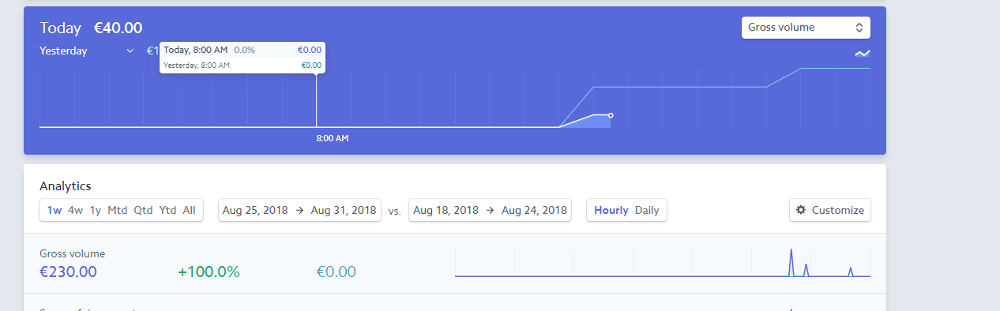

# Happy Box   

## Fictional E-Commerce Website Built With Python's Django Framework Using a PostgreSQL

This website is designed as to provide users with a full ecommerce site complete with authentication and Stripe payment functionality. The site also contains a blog where articles relating to the concept behind the products are displayed. 

The site provides a place where users can order "Happy Boxes" which contain a selection of goods to make their own or their loved one's world a happier place.

Inspired by the idea of "breakdown assist" for human emotion instead of motor vehicles along with the many subscription box and care package sites available online, this site seeks to provide a pick me up on demand. There are three categories of boxes for different situations life may throw at us (the boxes however can have multiple situation uses). 

## Live Demo

Follow this link to view deployed version of this website https://full-stack-nikral.herokuapp.com/

## UX

#### 1. Initial Planning 

The planning commenced with pen and paper brainstorming and some competitor e-commerce website analysis. Here ideas for an e-commerce site were considered. Happiness, wellbeing and self-care are so topical in the world we live in today. We lead such busy lives that happiness is at times hard to achieve nowadays. Inspired by this topic and an idea that came to me while looking at an advertisement for motor breakdown assist the concept of "Happy Box" as a pick me up available on demand was born. 

#### 2. User Stories

From here I decided to complete some user stories before commencing wireframing. This helped me to think through the user journey and design a good site map and navigation path. 

The following is a list of some user stories:

 - As a user of an e-commerce site, I need to be able to login/sign up/reset my password easily when I land on the site's homepage, this will encourage me to shop online more frequently.
 - As a user seeking an online shop for boxes containing multiple items, I want to be able to see exactly what I am getting for my money through images and content details, this will help me to choose the right product for me or a loved one. 
 - As a user to shop for items on the go to rescue me in a situation, I would like to be able to filter items easily in order to allow me to speedily choose the correct product for me.
 - As a user planning to buy a box for a special occasion or for a friend, I would like to be able to browse the site and save items in a Wishlist as I go so that I can easily find these when I decide to checkout. 
 - As a user who holds the opinion of other shoppers in high regard, I like to be able to see how each product is ranked by other customers easily so that I can weigh up the pros and cons of my shopping decisions.
 - As a user who is interested in the whole concept of what these products are based upon, I would like to be able to access the site blog posts easily in order to read further about the topics on hand.
 - As a user of an e-commerce site, I want to be able to securely pay for my products through a known payment host such as Stripe, this will give me peace of mind when ordering products.

#### 3. Wireframes

After the initial planning stage, I developed these wireframes using [Balsamiq](https://www.balsamiq.com "Balsamiq Homepage"). At this point I fine tuned down my features and layout. There were some cosmetic adjustments during the development process but on a whole the original mockups were followed quite closely. All wireframes have been included in a file labelled "Wireframes" for project review.

#### 4. Overall Look and Feel

As the overall concept of this website needs to conjure up feelings of happiness and a playful vibe, I took this into consideration in the visual design. 

The use of pink on navy on the navbar I feel sets a bold playful feel when you log on. The images have been carefully chosen to tie in with this feel throughout the site and also in the products themselves. One challenge which I was faced with was coming up with my own packaging for the site, being a fictional product, this presented its own challenges. I sourced some stock PSD files of packaging online and conducted some work on these to personalise them with Photoshop. 

### Features

- This is a multipage application website built using Twitter's Bootstrap framework for responsive layout and navigation. Please note that no template was used to create this site.
- There is full authorisation and Stripe payment functionality in place. 
- There are multiple apps in place within the Django Framework:
  - Home - renders the index.html and about.html templates, which in turn call the base.html template to present homepage and about pages with navbar, content and footer.
  - Accounts - this app offers full user authentication. When users first visit the website, they have two options under 'My Account' - Register if they have no account or Log In if they do. Once logged in the two options under 'My Account will then change to Profile or Log Out.
  - Products/categories - these apps display the Products that have been added via Django's admin panel which each are linked to a category.
  - Search - this app uses a simple Python function to search through all the products & render a filtered display of products or if no corresponding match renders a message with a link to all products.
  - Cart/Checkout - the cart app stores the item name, image, quantity and price of all products added to it and displays a cart total. The Checkout app then renders a form for a one-off Stripe payment.
  - Wishlist - this app stores the item name, image, quantity and price of all products added to the wishlist. A user can add items from here to the cart or delete from the wishlist if a user so wishes
  - Reviews - if a user is logged in they can leave a review which will be attached to a particular product. A message will appear confirming that your review will appear if approved by the admin for the site. When logged in as admin you can approve or reject all product reviews.
  - Contact - a user can fill out and send a contact form through this app and will receive a Django message confirming that their message has been sent and that they will get a response shortly.
  - Blog - blog_posts.html displays all blog posts that have been created, either via Django's admin panel or via the form in blogpostform.html. A post consists of a title, content, image and tag. The words are truncated to show only 30 words on the main screen, so users must click into the blog post to read the entire thing (postdetail.html) Only the superuser/admin can add blog posts. Comments can be added by logged in users.

#### Future Development

- I intend to setup live email functionality with perhaps a program such as SendGrid.
- I also intend on working on slug functionality to create absolute URLs for SEO purposes. Slugs are currently included in my models, but further development is needed to put them into production.
- In addition, an option of adding a personalised note with each box might be added.

### Technologies Used

- HTML5 
- CSS3
- [Fancybox](https://fancyapps.com/fancybox/3/ "Fancy Box Homepage") - used to display product images in a gallery
- [Bootstrap 3](https://getbootstrap.com/docs/3.3/ "Bootstrap Homepage")  - used for responsive layout and clean navigation.
- JavaScript  
- [jQuery](https://jquery.com/Jquery "JQuery Homepage") - Bootstrap uses jQuery for some of its navigation features e.g. collapsible navigation for mobile devices. 
- Python 3 
- [Django 2 Framework](https://docs.djangoproject.com/en/2.1/ "Django Homepage")
- SQLite - local database
- PostgreSQL - production database (served by Heroku)
- [AWS](https://eu-west-1.console.aws.amazon.com/console/home?region=eu-west-1 "AWS Homepage") - static file hosting

## Testing & Deployment

#### Automated Testing
Automated testing was done using Travis-CI.
1. Coverage was tested by running the following at the command line:

`$ sudo pip3 install coverage `

`$ coverage run manage.py test (app name)`

`$ coverage html`

This will create a htmlcov folder.

2. To view the percentage cover of your tests in the command line, run the following at the command line:

`$ python3 manage.py test`

`$ coverage report`

3. To update the html coverage report run:

`$ coverage html`

Then open and run the index.html file in the "htmlcov" folder.

I would like expand on my automated tests in the future.

#### Manual Testing

- All authorisation functionality has been manually tested to ensure in working order for example sign up, log in, password reset - please note that the confirmation emails for reset are currently printing out in the terminal. As mentioned in future development section these will be directed to real inboxes.
- Product purchasing functionality has been added. The Stripe payment function has been verified with test visa card details and all transactions show up on the Stripe dashboard:
  
- Contact functionality has also been tested - please note that the confirmation emails for reset are currently printing out in the terminal. As mentioned in future development section these will be directed to real inboxes.
- Wishlist functionality has been tested and is working correctly, a user can also add wishlist items to their cart.
- Product reviews have been tested are working as they ought to. A logged in user can leave a review which will be sent for approval by the site admin. When logged in as admin you can approve or reject.
- Blog comment functionality was tested and is working as it should. 
- All links were tested to ensure working correctly & all external links are opening on a new tab.
- All CSS code has passed the official [Jigsaw Validator](https://jigsaw.w3.org/css-validator/ "Jigsaw Validator Homepage")
- [Cross Browser Testing](https://crossbrowsertesting.com/ "Cross Browser Testing Homepage")  was used to ensure that the site has been tested for viewing support across the following browsers:
  - Google Chrome
  - Opera
  - Microsoft Edge
  - Internet Explorer 11
  - Mozilla Firefox
  - Safari
- Responsiveness has also been tested across multiple devices through the use of Google Dev Tools and also using the following resources:
  - [Responsinator](http://www.responsinator.com/ "Responsinator Homepage")
  - [Google Resizer](https://material.io/tools/resizer/ "Google Resizer Homepage")
  - [Mobile Test](http://mobiletest.me/ "Mobile test Homepage")
- Along with the emulator tests above, the site has been tested on my own phone along with other physical devices to ensure all looks and works as it should. 

#### Known Bugs

### Database/Static Files

When running locally, SQLite database was used & static and media files were stored locally. When deploying, Heroku Postgres was used as the server database & an Amazon S3 bucket was set up to host all the static files. The settings.py file was split into base, production and local and amended for the database & static files to point to the online resources. 

A number of relationships needed to be worked out in order for the site to function correctly. For example, due to the nature of each product needing multiple images, an image model with a foreign key relationship with the product model had to be out in place. Similarly, in order to provide product filtering by category a foreign key relationship had to be put in place between category and product models. 

### Deployment

The site has been deployed to be hosted on Heroku. (please see the live link above)

Below are the deployment instructions:
1. Navigate to your [Heroku](https://www.heroku.com/ "Heroku Homepage") dashboard, create a new app in Heroku (Europe). 
2. In "Deploy" choose GitHub as the deployment method and below this connect to the GitHub repository of your project. 
2. Initial deployment should be done manually. Upon successful deployment enable automatic deploys to allow deployment with each push to your repository.
3. The requirements.txt contains all of the dependencies required to run the app.
4. The Procfile communicates to Heroku how to run the app.
5. Heroku Postgres is used as the server database and AWS S3 used to host static files. You will need to create your own access keys (as per installation below). You can generate a Django secret key [here](https://www.miniwebtool.com/django-secret-key-generator/ "Django Secret Key"). Stripe secret keys will also need to be generated personally. These are all stored in Heroku config vars in the "Settings" tab.

### Installation

If you wish to clone this project, follow the below instructions. In developing this project, I used Cloud9. I recommend that this is used for cloning and the following instructions have been made with this in mind. If you are using a different editor, you may need to look at its documentation for your terminal commands.

1. Please note that access keys for AWS S3 and Stripe are hidden and tied to my accounts, you will need to obtain your own connections here [AWS](https://aws.amazon.com/?nc2=h_lg "AWS Homepage"), [Stripe](https://stripe.com/ie "Stripe Homepage").
2. If you wish to use the Cloud 9 code editor click here https://c9.io
3. Proceed to the folder which you want to store the cloned project and, in your terminal type: `$ git clone https://github.com/nikralave/full_stack_stream_four_happy_box.git`
4. Install the project dependencies: `$ sudo pip3 install -r requirements.txt`
5. When done cut ties with my GitHub: `$ git remote rm origin`

## Credits

#### Media
I would like to acknowledge the following media sources:

- The photos used on the home, about, contact and blog pages were obtained from a combination of sources including stock photo sites such as [Pexels](https://www.pexels.com/ "Pexels") and [Unsplash](https://unsplash.com/ "Unsplash") along with.
- Vector graphics were also used from [Flaticon](https://www.flaticon.com/ "Flaticon Site") 

#### Content
The product content images used were sourced mainly from the following online stores: https://www.bando.com/, https://www.urbanoutfitters.com/, https://www.paperchase.co.uk/ and http://www.asos.com/
